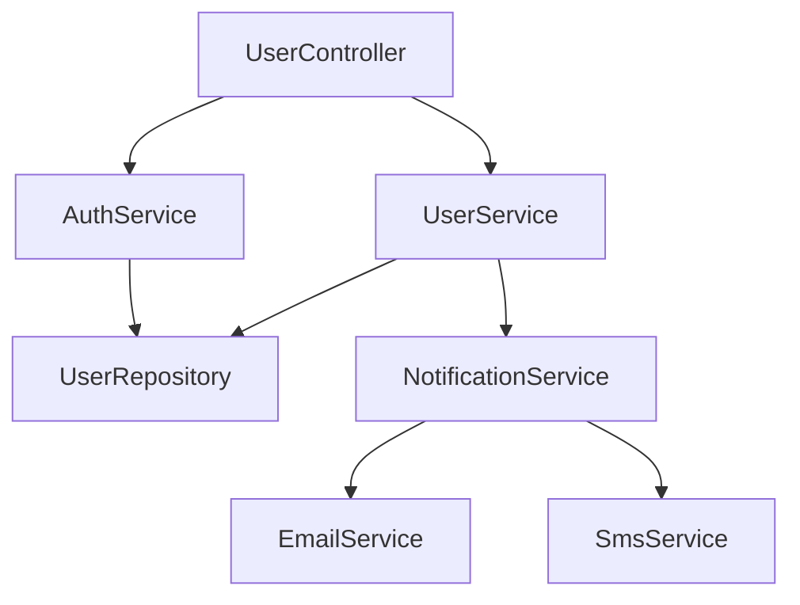

# Report 05: Autowiring Graph

## Descrizione
Mappa completa delle dependency injection nell'applicazione Spring Boot, tracciando chi inietta chi attraverso @Autowired, @Inject, constructor injection, e altre tecniche di DI, con visualizzazione grafica delle relazioni.

## Valore per l'Utente
**⭐⭐⭐⭐⭐** - Valore Massimo
- Comprensione dell'architettura delle dipendenze
- Identificazione di dipendenze circolari
- Analisi della complessità del sistema
- Ottimizzazione delle performance di startup
- Refactoring guidato dall'analisi delle dipendenze
- Troubleshooting di problemi di injection

## Complessità di Implementazione
**🔴 Complessa** - Richiede analisi avanzata di bytecode e annotations

## Tempo di Realizzazione Stimato
**10-12 giorni** di sviluppo

## Sezioni del Report

### 1. Executive Summary
- Totale injection point identificati
- Distribuzione per tipo di injection (field, constructor, method)
- Componenti con più dipendenze (coupling analysis)
- Dipendenze circolari rilevate
- Beans più utilizzati (popularity ranking)

### 2. Injection Types Analysis
```
Dependency Injection Overview
├── Constructor Injection: 156 (62% - Recommended)
├── Field Injection: 89 (35% - Discouraged)
├── Method Injection: 8 (3% - Rare)
└── Interface Injection: 0 (0% - Not used)

Quality Score: 7.2/10
```

### 3. Dependency Graph Visualization

#### 3.1 High-Level Component Dependencies:


#### 3.2 Detailed Injection Points:
```java
@RestController
public class UserController {
    
    private final UserService userService;        // Constructor injection
    private final AuthService authService;        // Constructor injection
    
    @Autowired
    private MetricsCollector metricsCollector;    // Field injection (anti-pattern)
    
    public UserController(UserService userService, AuthService authService) {
        this.userService = userService;  // ✓ Best practice
        this.authService = authService;  // ✓ Best practice
    }
}
```

### 4. Circular Dependencies Analysis

#### 4.1 Detected Circles:
```
Circular Dependency Chain #1:
ServiceA → ServiceB → ServiceC → ServiceA
├── ServiceA.methodX() depends on ServiceB
├── ServiceB.methodY() depends on ServiceC  
└── ServiceC.methodZ() depends on ServiceA

Resolution Strategy: @Lazy annotation or interface segregation
```

#### 4.2 Dependency Depth Analysis:
- **Shallow Dependencies** (1-2 levels): 67%
- **Medium Dependencies** (3-5 levels): 28%  
- **Deep Dependencies** (6+ levels): 5%

### 5. Bean Popularity Ranking

#### 5.1 Most Injected Beans:
1. **UserRepository** - Injected in 23 classes
2. **AuthService** - Injected in 18 classes
3. **ConfigurationProperties** - Injected in 15 classes
4. **EntityManager** - Injected in 12 classes

#### 5.2 Singleton vs Prototype Analysis:
- **Singleton Beans**: 234 (98%)
- **Prototype Beans**: 5 (2%)
- **Request Scoped**: 3 (1%)
- **Session Scoped**: 1 (<1%)

### 6. Injection Quality Assessment

#### 6.1 Best Practices Compliance:
- ✅ **Constructor Injection Preferred**: 62%
- ❌ **Field Injection Usage**: 35% (should be minimized)
- ✅ **Final Fields**: 89% of constructor-injected fields
- ✅ **Single Constructor**: 76% of classes

#### 6.2 Anti-Patterns Detected:
- Field injection in @Controller classes
- Circular dependencies via field injection
- Missing @Qualifier for multiple beans of same type
- Over-dependency: Classes with >10 dependencies

## Implementazione Javassist

### Analisi Injection Points

```java
public class AutowiringAnalyzer {
    
    private final ClassPool classPool;
    private final DependencyGraph dependencyGraph = new DependencyGraph();
    private final Map<String, BeanInfo> beans = new HashMap<>();
    
    public AutowiringAnalysis analyzeAutowiring() {
        // 1. Identifica tutti i Spring beans
        discoverSpringBeans();
        
        // 2. Analizza injection points
        analyzeInjectionPoints();
        
        // 3. Costruisce dependency graph
        buildDependencyRelationships();
        
        // 4. Rileva circular dependencies
        detectCircularDependencies();
        
        // 5. Calcola metriche qualità
        calculateQualityMetrics();
        
        return new AutowiringAnalysis(dependencyGraph, beans);
    }
    
    private void discoverSpringBeans() {
        for (CtClass clazz : classPool.getAllClasses()) {
            if (isSpringBean(clazz)) {
                BeanInfo beanInfo = analyzeBeanInfo(clazz);
                beans.put(clazz.getName(), beanInfo);
            }
        }
    }
    
    private boolean isSpringBean(CtClass clazz) {
        return clazz.hasAnnotation("org.springframework.stereotype.Component") ||
               clazz.hasAnnotation("org.springframework.stereotype.Service") ||
               clazz.hasAnnotation("org.springframework.stereotype.Repository") ||
               clazz.hasAnnotation("org.springframework.stereotype.Controller") ||
               clazz.hasAnnotation("org.springframework.web.bind.annotation.RestController") ||
               clazz.hasAnnotation("org.springframework.context.annotation.Configuration");
    }
}
```

### Analisi Constructor Injection

```java
private void analyzeConstructorInjection(CtClass clazz, BeanInfo beanInfo) {
    try {
        CtConstructor[] constructors = clazz.getConstructors();
        
        for (CtConstructor constructor : constructors) {
            // Constructor con @Autowired esplicito
            if (constructor.hasAnnotation("org.springframework.beans.factory.annotation.Autowired")) {
                analyzeConstructorParameters(constructor, beanInfo, true);
            }
            // Single constructor (implicit autowiring in Spring)
            else if (constructors.length == 1 && !Modifier.isPrivate(constructor.getModifiers())) {
                analyzeConstructorParameters(constructor, beanInfo, false);
            }
        }
        
    } catch (NotFoundException e) {
        logger.warn("Error analyzing constructors for {}", clazz.getName(), e);
    }
}

private void analyzeConstructorParameters(CtConstructor constructor, BeanInfo beanInfo, boolean explicitAutowired) {
    try {
        CtClass[] paramTypes = constructor.getParameterTypes();
        Annotation[][] paramAnnotations = constructor.getParameterAnnotations();
        
        for (int i = 0; i < paramTypes.length; i++) {
            DependencyInfo dependency = new DependencyInfo();
            dependency.setTargetType(paramTypes[i].getName());
            dependency.setInjectionType(InjectionType.CONSTRUCTOR);
            dependency.setExplicitAutowired(explicitAutowired);
            
            // Analizza @Qualifier
            for (Annotation annotation : paramAnnotations[i]) {
                if ("org.springframework.beans.factory.annotation.Qualifier".equals(
                    annotation.getTypeName())) {
                    String qualifierValue = getAnnotationValue(annotation, "value");
                    dependency.setQualifier(qualifierValue);
                }
                
                // @Lazy annotation
                if ("org.springframework.context.annotation.Lazy".equals(
                    annotation.getTypeName())) {
                    dependency.setLazy(true);
                }
                
                // @Value annotation
                if ("org.springframework.beans.factory.annotation.Value".equals(
                    annotation.getTypeName())) {
                    String valueExpression = getAnnotationValue(annotation, "value");
                    dependency.setValueExpression(valueExpression);
                    dependency.setInjectionType(InjectionType.VALUE);
                }
            }
            
            beanInfo.addDependency(dependency);
        }
        
    } catch (NotFoundException e) {
        logger.warn("Error analyzing constructor parameters", e);
    }
}
```

### Analisi Field Injection

```java
private void analyzeFieldInjection(CtClass clazz, BeanInfo beanInfo) {
    try {
        for (CtField field : clazz.getDeclaredFields()) {
            if (field.hasAnnotation("org.springframework.beans.factory.annotation.Autowired")) {
                DependencyInfo dependency = analyzeAutowiredField(field);
                beanInfo.addDependency(dependency);
                
                // Marca come anti-pattern se non è una configurazione speciale
                if (!isAcceptableFieldInjection(field)) {
                    dependency.setAntiPattern(true);
                    dependency.addIssue("Field injection discouraged - use constructor injection");
                }
            }
            
            if (field.hasAnnotation("org.springframework.beans.factory.annotation.Value")) {
                DependencyInfo dependency = analyzeValueField(field);
                beanInfo.addDependency(dependency);
            }
        }
        
    } catch (NotFoundException e) {
        logger.warn("Error analyzing fields for {}", clazz.getName(), e);
    }
}

private DependencyInfo analyzeAutowiredField(CtField field) throws NotFoundException {
    DependencyInfo dependency = new DependencyInfo();
    dependency.setFieldName(field.getName());
    dependency.setTargetType(field.getType().getName());
    dependency.setInjectionType(InjectionType.FIELD);
    
    // @Autowired attributes
    Annotation autowired = field.getAnnotation("Autowired");
    boolean required = getAnnotationBooleanValue(autowired, "required", true);
    dependency.setRequired(required);
    
    // @Qualifier
    if (field.hasAnnotation("org.springframework.beans.factory.annotation.Qualifier")) {
        Annotation qualifier = field.getAnnotation("Qualifier");
        String qualifierValue = getAnnotationValue(qualifier, "value");
        dependency.setQualifier(qualifierValue);
    }
    
    // @Lazy
    if (field.hasAnnotation("org.springframework.context.annotation.Lazy")) {
        dependency.setLazy(true);
    }
    
    // Check if field is final (impossible with field injection)
    if (Modifier.isFinal(field.getModifiers())) {
        dependency.addIssue("Final field with field injection - impossible to set");
    }
    
    return dependency;
}

private boolean isAcceptableFieldInjection(CtField field) {
    try {
        // Acceptable cases for field injection
        CtClass declaringClass = field.getDeclaringClass();
        
        // Test classes
        if (declaringClass.getName().contains("Test")) {
            return true;
        }
        
        // @ConfigurationProperties classes
        if (declaringClass.hasAnnotation("org.springframework.boot.context.properties.ConfigurationProperties")) {
            return true;
        }
        
        // Static fields (rare but sometimes necessary)
        if (Modifier.isStatic(field.getModifiers())) {
            return true;
        }
        
        return false;
        
    } catch (Exception e) {
        return false;
    }
}
```

### Analisi Method Injection

```java
private void analyzeMethodInjection(CtClass clazz, BeanInfo beanInfo) {
    try {
        for (CtMethod method : clazz.getDeclaredMethods()) {
            if (method.hasAnnotation("org.springframework.beans.factory.annotation.Autowired")) {
                List<DependencyInfo> methodDependencies = analyzeAutowiredMethod(method);
                methodDependencies.forEach(beanInfo::addDependency);
            }
        }
        
    } catch (NotFoundException e) {
        logger.warn("Error analyzing methods for {}", clazz.getName(), e);
    }
}

private List<DependencyInfo> analyzeAutowiredMethod(CtMethod method) throws NotFoundException {
    List<DependencyInfo> dependencies = new ArrayList<>();
    
    CtClass[] paramTypes = method.getParameterTypes();
    Annotation[][] paramAnnotations = method.getParameterAnnotations();
    
    for (int i = 0; i < paramTypes.length; i++) {
        DependencyInfo dependency = new DependencyInfo();
        dependency.setTargetType(paramTypes[i].getName());
        dependency.setInjectionType(InjectionType.METHOD);
        dependency.setSetterMethod(method.getName());
        
        // Analizza parameter annotations
        for (Annotation annotation : paramAnnotations[i]) {
            analyzeParameterAnnotation(annotation, dependency);
        }
        
        dependencies.add(dependency);
    }
    
    return dependencies;
}
```

### Costruzione Dependency Graph

```java
private void buildDependencyRelationships() {
    // Crea nodi per ogni bean
    for (BeanInfo beanInfo : beans.values()) {
        DependencyNode node = new DependencyNode(beanInfo.getClassName());
        node.setBeanInfo(beanInfo);
        dependencyGraph.addNode(node);
    }
    
    // Crea edges per ogni dipendenza
    for (BeanInfo beanInfo : beans.values()) {
        DependencyNode sourceNode = dependencyGraph.getNode(beanInfo.getClassName());
        
        for (DependencyInfo dependency : beanInfo.getDependencies()) {
            String targetClassName = dependency.getTargetType();
            DependencyNode targetNode = dependencyGraph.getNode(targetClassName);
            
            if (targetNode != null) {
                DependencyEdge edge = new DependencyEdge(sourceNode, targetNode, dependency);
                dependencyGraph.addEdge(edge);
            } else {
                // External dependency (not a Spring bean)
                ExternalDependency extDep = new ExternalDependency(targetClassName);
                beanInfo.addExternalDependency(extDep);
            }
        }
    }
}
```

### Rilevamento Circular Dependencies

```java
private void detectCircularDependencies() {
    List<List<String>> cycles = new ArrayList<>();
    Set<String> visited = new HashSet<>();
    Set<String> recursionStack = new HashSet<>();
    
    for (DependencyNode node : dependencyGraph.getNodes()) {
        if (!visited.contains(node.getClassName())) {
            List<String> currentPath = new ArrayList<>();
            if (hasCycleDFS(node, visited, recursionStack, currentPath)) {
                cycles.add(new ArrayList<>(currentPath));
            }
        }
    }
    
    // Analizza ogni ciclo per determinare la severità e suggerimenti
    for (List<String> cycle : cycles) {
        CircularDependency circularDep = new CircularDependency(cycle);
        analyzeCircularDependencySeverity(circularDep);
        dependencyGraph.addCircularDependency(circularDep);
    }
}

private boolean hasCycleDFS(DependencyNode node, Set<String> visited, 
                           Set<String> recursionStack, List<String> currentPath) {
    
    String className = node.getClassName();
    visited.add(className);
    recursionStack.add(className);
    currentPath.add(className);
    
    for (DependencyEdge edge : node.getOutgoingEdges()) {
        String targetClassName = edge.getTarget().getClassName();
        
        if (!visited.contains(targetClassName)) {
            if (hasCycleDFS(edge.getTarget(), visited, recursionStack, currentPath)) {
                return true;
            }
        } else if (recursionStack.contains(targetClassName)) {
            // Ciclo trovato - estrai il ciclo dalla posizione trovata
            int cycleStart = currentPath.indexOf(targetClassName);
            List<String> cycle = currentPath.subList(cycleStart, currentPath.size());
            cycle.add(targetClassName); // Chiudi il ciclo
            return true;
        }
    }
    
    recursionStack.remove(className);
    currentPath.remove(currentPath.size() - 1);
    return false;
}

private void analyzeCircularDependencySeverity(CircularDependency circularDep) {
    List<String> cycle = circularDep.getCycle();
    
    // Verifica se ci sono @Lazy annotations che potrebbero risolvere il ciclo
    boolean hasLazyResolution = false;
    for (int i = 0; i < cycle.size() - 1; i++) {
        String source = cycle.get(i);
        String target = cycle.get(i + 1);
        
        DependencyEdge edge = dependencyGraph.getEdge(source, target);
        if (edge != null && edge.getDependency().isLazy()) {
            hasLazyResolution = true;
            break;
        }
    }
    
    if (hasLazyResolution) {
        circularDep.setSeverity(CircularDependencySeverity.LOW);
        circularDep.setResolutionStatus("Resolved via @Lazy");
    } else {
        circularDep.setSeverity(CircularDependencySeverity.HIGH);
        circularDep.addSuggestion("Add @Lazy to one of the dependencies");
        circularDep.addSuggestion("Consider using interface segregation");
        circularDep.addSuggestion("Introduce an intermediate service");
    }
}
```

### Calcolo Quality Metrics

```java
private QualityMetrics calculateQualityMetrics() {
    QualityMetrics metrics = new QualityMetrics();
    
    int totalDependencies = 0;
    int constructorInjections = 0;
    int fieldInjections = 0;
    int methodInjections = 0;
    int antiPatterns = 0;
    
    for (BeanInfo beanInfo : beans.values()) {
        for (DependencyInfo dependency : beanInfo.getDependencies()) {
            totalDependencies++;
            
            switch (dependency.getInjectionType()) {
                case CONSTRUCTOR:
                    constructorInjections++;
                    break;
                case FIELD:
                    fieldInjections++;
                    if (dependency.isAntiPattern()) {
                        antiPatterns++;
                    }
                    break;
                case METHOD:
                    methodInjections++;
                    break;
            }
        }
    }
    
    metrics.setTotalDependencies(totalDependencies);
    metrics.setConstructorInjectionRatio((double) constructorInjections / totalDependencies);
    metrics.setFieldInjectionRatio((double) fieldInjections / totalDependencies);
    metrics.setMethodInjectionRatio((double) methodInjections / totalDependencies);
    metrics.setAntiPatternCount(antiPatterns);
    
    // Calcola quality score
    double qualityScore = calculateOverallQualityScore(metrics);
    metrics.setQualityScore(qualityScore);
    
    return metrics;
}
```

## Struttura Output Report

```json
{
  "summary": {
    "totalBeans": 156,
    "totalDependencies": 387,
    "injectionTypes": {
      "constructor": 240,
      "field": 137,
      "method": 10
    },
    "qualityScore": 7.2,
    "circularDependencies": 2
  },
  "dependencyGraph": {
    "nodes": [
      {
        "className": "com.example.UserController",
        "beanType": "CONTROLLER",
        "dependencies": [
          {
            "targetType": "com.example.UserService",
            "injectionType": "CONSTRUCTOR",
            "required": true,
            "lazy": false
          }
        ]
      }
    ],
    "edges": [
      {
        "source": "com.example.UserController",
        "target": "com.example.UserService",
        "injectionType": "CONSTRUCTOR"
      }
    ]
  },
  "circularDependencies": [
    {
      "cycle": ["ServiceA", "ServiceB", "ServiceC", "ServiceA"],
      "severity": "HIGH",
      "resolutionSuggestions": ["Add @Lazy annotation", "Use interface segregation"]
    }
  ],
  "popularityRanking": [
    {"beanName": "UserRepository", "usageCount": 23},
    {"beanName": "AuthService", "usageCount": 18}
  ],
  "qualityAnalysis": {
    "antiPatterns": [
      {
        "type": "FIELD_INJECTION_IN_CONTROLLER",
        "locations": ["UserController.metricsCollector"],
        "suggestion": "Use constructor injection instead"
      }
    ],
    "recommendations": [
      "Reduce field injection from 35% to <10%",
      "Resolve 2 circular dependencies",
      "Consider @Lazy for performance optimization"
    ]
  }
}
```

## Metriche di Qualità del Codice

### Algoritmo di Calcolo (0-100)

```java
public int calculateAutoWiringQualityScore(AutowiringAnalysisReport result) {
    double score = 100.0;
    
    // Penalizzazioni per problemi dependency injection critici
    score -= result.getCircularDependencies() * 25;           // -25 per ogni dipendenza circolare
    score -= result.getFieldInjectionAntiPatterns() * 8;     // -8 per ogni field injection anti-pattern
    score -= result.getMissingRequiredDependencies() * 20;   // -20 per dipendenze required mancanti
    score -= result.getOverCoupledComponents() * 15;         // -15 per componenti over-coupled (>10 deps)
    score -= result.getAmbiguousQualifiers() * 10;           // -10 per qualifier ambigui o mancanti
    score -= result.getNonFinalInjectedFields() * 6;         // -6 per campi injected non final
    score -= result.getUnresolvedDependencies() * 12;        // -12 per dipendenze non risolvibili
    score -= result.getPrototypeBeanInSingleton() * 18;      // -18 per prototype bean in singleton
    
    // Bonus per buone pratiche DI
    score += result.getConstructorInjectionRatio() * 15;     // +15 per alta % constructor injection
    score += result.getProperlyQualifiedBeans() * 2;        // +2 per qualifier appropriati
    score += result.getLazyInitOptimizations() * 3;         // +3 per uso @Lazy appropriato
    score += result.getInterfaceBasedDependencies() * 2;    // +2 per dipendenze su interface
    
    return Math.max(0, Math.min(100, (int) score));
}
```

### Soglie di Valutazione
- **0-40**: 🔴 CRITICO - Architettura DI problematica con gravi issues
- **41-60**: 🟡 SUFFICIENTE - DI funzionante ma con anti-patterns significativi
- **61-80**: 🟢 BUONO - Buona gestione DI con minor improvements necessari
- **81-100**: ⭐ ECCELLENTE - Architettura DI ottimale e best practices

## Segnalazioni per Gravità

### 🔴 GRAVITÀ CRITICA (Score Impact: -18 to -25)
1. **Dipendenze circolari non risolte**
   - Descrizione: Cicli di dipendenze tra bean che impediscono l'inizializzazione
   - Rischio: ApplicationContext startup failure, impossibilità avvio applicazione
   - Soluzione: Utilizzare @Lazy, interface segregation, o ristrutturazione architetturale

2. **Dipendenze required mancanti**
   - Descrizione: Bean richiesti non trovati nel contesto Spring
   - Rischio: NoSuchBeanDefinitionException, crash applicazione
   - Soluzione: Verificare configurazione bean, package scan, o aggiungere @Component

3. **Prototype bean iniettato in singleton**
   - Descrizione: Bean prototype iniettato via constructor/field in singleton
   - Rischio: Perdita semantica prototype, memory leak potenziale
   - Soluzione: Utilizzare Provider<T>, @Lookup, o ObjectFactory

### 🟠 GRAVITÀ ALTA (Score Impact: -12 to -15)  
4. **Componenti over-coupled (>10 dipendenze)**
   - Descrizione: Classi con troppe dipendenze iniettate
   - Rischio: Violazione Single Responsibility Principle, difficile testing
   - Soluzione: Scomporre in classi più piccole, introdurre facade pattern

5. **Dipendenze non risolvibili**
   - Descrizione: Injection point che non possono essere soddisfatti
   - Rischio: Errori runtime, comportamento inaspettato
   - Soluzione: Verificare configurazione, aggiungere @Qualifier appropriati

### 🟡 GRAVITÀ MEDIA (Score Impact: -6 to -10)
6. **Qualifier ambigui o mancanti**
   - Descrizione: Multiple bean dello stesso tipo senza qualifier appropriati
   - Rischio: NoUniqueBeanDefinitionException, injection errate
   - Soluzione: Aggiungere @Qualifier o @Primary a bean appropriati

7. **Field injection anti-patterns**
   - Descrizione: Uso di @Autowired su campi invece di constructor injection
   - Rischio: Testing difficile, immutabilità compromessa, reflection overhead
   - Soluzione: Convertire a constructor injection con final fields

### 🔵 GRAVITÀ BASSA (Score Impact: -1 to -6)
8. **Campi iniettati non final**
   - Descrizione: Dependency injection su campi non marcati come final
   - Rischio: Mutabilità indesiderata, possibili reassignments accidentali
   - Soluzione: Marcare campi iniettati come final dove possibile

## Metriche di Valore

- **Architecture Quality**: Migliora comprensione e qualità architettura dependency injection
- **Startup Performance**: Identifica ottimizzazioni per ridurre tempo avvio
- **Testability**: Facilita unit testing attraverso migliore DI design
- **Maintainability**: Riduce coupling e migliora modularità del codice

## Classificazione

**Categoria**: Architecture & Dependencies
**Priorità**: Critica - DI è fondamentale per architettura Spring
**Stakeholder**: Development team, Solution architects, Tech leads

## Tags per Classificazione

`#dependency-injection` `#autowiring` `#spring-beans` `#circular-dependencies` `#architecture-analysis` `#code-quality` `#high-value` `#complex`